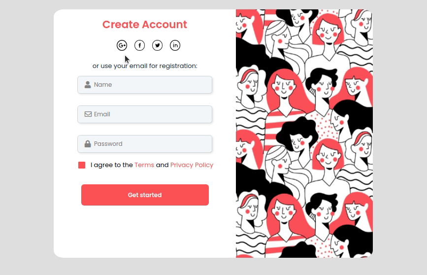

<h1 align="center"> Form Validation ✔️ </h1>

  <a href="#-projeto">Projeto</a>&nbsp;&nbsp;&nbsp;|&nbsp;&nbsp;&nbsp;
  <a href="#%EF%B8%8F-tecnologias">Tecnologias</a>&nbsp;&nbsp;&nbsp;|&nbsp;&nbsp;&nbsp;
  <a href="#--funcionalidades">Funcionalidades</a>&nbsp;&nbsp;&nbsp;|&nbsp;&nbsp;&nbsp;
  <a href="#%EF%B8%8F--autor">Autor</a>&nbsp;&nbsp;&nbsp;|&nbsp;&nbsp;&nbsp;
  <a href="#-licen%C3%A7a">Licença</a>

  

 

## 💡 Projeto
O projeto tem o iobjetivo de simular um formulário. Utilizando Javascript, CSS e HTML para validar se os dados foram ou não informados.

 

## ⚙️ Tecnologias

- [Javascript](https://developer.mozilla.org/pt-BR/docs/Web/JavaScript)
- [CSS](https://developer.mozilla.org/pt-BR/docs/Web/CSS)
- [HTML](https://developer.mozilla.org/pt-BR/docs/Web/HTML)

   

## 🔨 Funcionalidades

- [x] O usuário pode inserir seus dados: nome, email e senha.
- [x] Se algum dado estiver faltando, o usuário será informado que tal campo é obrigatório.

 

## ✒️ Autor

 

👤 **Gabriel Henrique**

- Github: [@Gabriek0](https://github.com/Gabriek0)
- LinkedIn: [@gabriel-henrique-664bb219a](https://www.linkedin.com/in/gabriel-henrique-664bb219a/)

 

## 📜 Licença

- 